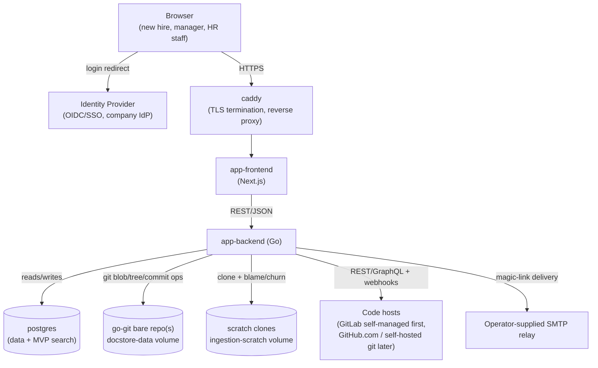

# cold_start — Architecture

> Companion to [01-overview.md](01-overview.md) (vision/scope) and [02-tech-stack.md](02-tech-stack.md) (technology picks). This document describes how the chosen stack is assembled into a system: components, data flow, storage layout, and deployment topology. It also resolves the tech-stack doc's open questions where an answer is needed to describe the architecture coherently, and defers the rest explicitly.

## 1. System Context

Everything runs as one deployable unit per company (self-hosted, single-tenant — per the overview's non-goals), fronted by Caddy for TLS termination and routing.

Full diagram set — component breakdown, deployment topology, and a sequence diagram per data flow in §3 — lives in [05-architecture-diagrams.md](05-architecture-diagrams.md).

## 2. Components

### 2.1 app-frontend (Next.js)

- Renders the dashboard (repo health, "who to ask"), the doc editor (TipTap/ProseMirror-based WYSIWYG), the onboarding planner UI, and search.
- Talks to `app-backend` only over its REST API — no direct DB or git access. Keeps the frontend stateless and replaceable independent of storage decisions.
- Auth handled via server-side session cookie issued by the backend after OIDC or magic-link login completes; the frontend never sees IdP tokens directly beyond the login redirect (backend owns the OIDC client).
- SSR is used selectively (dashboard pages that need fresh server-rendered data, e.g., "who to ask" expertise signals in Phase 0, staleness signals once Phase 1 ships) but most of the app can run as client-rendered SPA-style routes — resolved during review: full SSR is not a hard requirement, so the deployment doesn't depend on it; Next.js standalone output is kept because it doesn't cost anything to keep the option open, not because SSR is load-bearing.

### 2.2 app-backend (Go)

Organized as a single binary/service at MVP (per the tech-stack doc's rejection of a separate queue service), internally modularized into:

- **API layer** — REST endpoints consumed by the frontend; owns request validation and response shaping. No business logic lives here beyond routing/auth checks.
- **Auth/RBAC module** — OIDC client + magic-link fallback (§6 of tech-stack doc; no standalone local password), session issuance, and `(user, role, resource_type, resource_id)` permission checks used by every other module (tech-stack §6 — replaces an earlier bare `(user, role, scope)` design that couldn't disambiguate grants across resource types). Owns the anti-merge rule for the two login paths: an OIDC login arriving for an email that already has a magic-link account is never auto-linked by email match alone — it requires an explicit confirmation step, and any account-recovery-equivalent event invalidates existing sessions (tech-stack §6, mitigating the Classic-Federated Merge attack class).
- **Doc-store engine** — the component that owns the `go-git`-managed bare repo(s). Translates "save this page" web requests into git blob/tree/commit operations, and "show history/diff/rollback" requests into `git log`/`git diff`/revert-equivalent library calls. This is the only component permitted to touch the doc-store repo(s) — no other module writes to that volume directly.
- **Ingestion workers** — an in-process worker pool (goroutines + a lightweight internal queue, no external broker at MVP) that: (a) runs scheduled polling as the default update trigger, (b) optionally receives webhook events from connected code hosts where the operator has exposed reachable ingress (see tech-stack doc §5 — not assumed for self-hosted deployments without public ingress), (c) performs local full (non-shallow) clones on the scratch volume for blame/churn analysis — full-depth specifically because `git blame` on a shallow clone misattributes any line whose real last-touching commit falls outside the fetch boundary, which would silently break the accuracy of whatever consumes this data, (d) calls host APIs for PR/review metadata, and (e) writes derived "who to ask" expertise signals into Postgres — **Phase 0**. Doc-staleness detection (comparing this same churn data against doc content/freshness) and repo-doc content extraction for search are **Phase 1**, layered on top of this same blame/churn pass once it exists, not built alongside it in Phase 0 — see [04-open-items.md](04-open-items.md). Implements the `RepoProvider` interface named in the tech-stack doc so GitHub/GitLab/self-hosted-git backends are swappable without touching the rest of the pipeline (also Phase 1).
- **Onboarding planner module** — standard CRUD over plan templates, plan-step definitions, and per-hire progress records; the least architecturally risky part of the system, built directly against Postgres. Steps that reference a doc-store page store the doc's stable metadata-row ID (§2.3), never a raw path — plan templates are explicitly long-lived and reused across hires (overview §5.3), so a step must keep resolving correctly after the referenced page is renamed or moved, which a path string can't guarantee but the existing metadata ID already does. Progression through a plan is **gated**: the module rejects a completion request for step N+1 while step N is still incomplete, rather than accepting completions in any order. Each per-hire step record captures `started_at`/`completed_at` timestamps in addition to its status, from Phase 0 — required for the Phase 2 analytics feature (overview §6), which can't be backfilled for hires onboarded before the timestamps existed.
- **Search module** — wraps Postgres FTS behind an interface narrow enough that swapping in Meilisearch later (tech-stack §7) means implementing one new adapter, not touching callers. Every query it runs is filtered by the caller's current `(resource_type, resource_id)` grants, evaluated as part of the query itself (not a filter applied to already-fetched results, and never sourced from a permission state cached at index time) — the module has no "search everything" mode, from Phase 0. Indexes doc-store content from Phase 0 (structurally tied to the doc-save flow, §3.2); repo-doc content (§3.1 step 4, Phase 1) joins the same corpus under the same query-time filter once that ingestion step ships — the filtering rule doesn't change between the two, only the corpus grows.

### 2.3 postgres

Single database for MVP, holding:

- Users, roles, `(user, role, resource_type, resource_id)` grants, sessions.
- Repo connections (host type, credentials/tokens, sync state).
- Ingested/derived data: commit-author aggregates, per-path expertise scores (Phase 0), doc-staleness flags (Phase 1, added once repo-doc content ingestion exists to compare churn against) — a periodically refreshed *cache* of what ingestion computed, not a source of truth (the source of truth is the code host + local clones re-derivable at any time).
- Non-code doc **metadata**: page titles, structured-content type, the doc-space `resource_id` it belongs to (§5), pointer to its path inside the doc-store repo. The doc *content itself* lives in the git repo, not in Postgres — Postgres indexes and searches over content synced from git on write, per §3.2.
- Onboarding plan templates, plan-step definitions, per-hire progress (status plus `started_at`/`completed_at` per step, §2.2).
- Full-text search indexes (`tsvector` columns) over the actual searchable corpus: doc-store content (synced on write, §3.2) and ingested repo-documentation content (§3.1 step 4). The derived ingestion signals (expertise scores, staleness flags) are structured dashboard data, not text-search content, and aren't part of this index. Every indexed row carries the `(resource_type, resource_id)` needed for the search module's query-time filter (§2.2).

### 2.4 Doc-store bare repo(s) (volume, via go-git)

Repo layout (resolved during review, see [04-open-items.md](04-open-items.md) §3): **one bare repo per company instance at MVP**, not per-team/per-space. Rationale: the cold_start instance is already single-tenant per company (non-goal in the overview), so a single repo covers the whole non-code doc corpus; splitting by team adds operational complexity (multiple repos to GC, back up, and reason about for cross-team search) without a concrete MVP requirement driving it. Structured content types (team page, process, FAQ) are stored as files with YAML front-matter encoding the type and metadata, under a directory convention (e.g. `/teams/<slug>.md`, `/processes/<slug>.md`) — human-inspectable if the repo is ever exported via `git bundle`, per the tech-stack doc's portability point. Revisit per-space repos only if cross-company multi-tenancy (explicitly deferred in the overview) becomes real.

Conflict resolution (resolved during review): MVP uses **optimistic locking** — the editor UI carries the base commit hash it was loaded from; a save request whose base hash no longer matches `HEAD` is rejected with a "this page changed, reload to see the latest version" response rather than silently overwritten or auto-merged. A merge UI is explicitly deferred; it's only worth building once concurrent edits on the same page are observed to be common in practice.

GC/repack cadence (resolved during review): a scheduled internal job (same worker pool as ingestion, run on a daily cadence) shells out to `git gc --auto` against the bare repo(s). This is the one place the doc-store engine intentionally steps outside pure-`go-git` calls, mirroring the ingestion side's precedent of shelling out to native `git` for anything git-native tooling does better than the pure-Go library.

The git-over-HTTP escape hatch (tracked in [04-open-items.md](04-open-items.md)) is left deferred, as the tech-stack doc suggested — noted here as a Phase 2+ candidate that the chosen storage model (a real repo on disk) keeps cheap to add later, requiring no data migration when it happens.

### 2.5 Scratch volume (ingestion clones)

Ephemeral, wipeable full (non-shallow) clones used only for blame/churn analysis — full-depth so blame attribution stays accurate for files that haven't changed recently (see §2.2). Never read by any component other than the ingestion workers; never backed up.

## 3. Key Data Flows

### 3.1 Repository ingestion → "who to ask" (Phase 0) / staleness signals & repo-doc search (Phase 1)

1. Admin registers a repo connection (host type, auth token, target repo) via the frontend → stored in Postgres.
2. Backend schedules polling for the connection by default; a webhook is additionally registered only if the operator has confirmed the instance has reachable ingress (direct or via relay) for that host — per tech-stack §5, this can't be assumed for a self-hosted deployment without public exposure.
3. **(Phase 0)** On a poll tick (or webhook delivery, where enabled): ingestion worker (a) calls the host API for new commits/PR/review metadata, (b) refreshes a full (non-shallow) local clone on the scratch volume, (c) runs `git blame`/`git log --stat` locally to compute per-path contribution and churn, (d) combines both into per-path expertise scores, (e) writes results into Postgres.
4. **(Phase 1)** From the same local clone, the worker also reads the text content of the repo connection's configured documentation paths (e.g. `README.md`, `/docs`) and writes it into the search corpus (tech-stack §7) tagged with `(resource_type=repo_connection, resource_id=<repo>)` (§5) — the step that populates the "connected repos' docs" half of unified search (overview 5.4). Once this exists, step 3's churn data can be compared against it to compute doc-staleness flags — staleness detection is sequenced after this step specifically because it needs to know when the docs it's comparing against were last touched, which step 3 alone doesn't tell it.
5. Frontend dashboard reads the precomputed signals from Postgres — no live git/API calls on the request path, keeping dashboard loads fast and host-rate-limit-independent. Shows expertise scores from Phase 0; staleness flags appear once Phase 1 ships.

### 3.2 Non-code doc edit

1. User opens a doc page in the WYSIWYG editor; frontend fetches current content + base commit hash from `app-backend` (backend reads it from the bare repo via `go-git`).
2. On save, frontend sends new content + the base hash it started from.
3. Doc-store engine checks the base hash against current `HEAD` for that path (optimistic lock, §2.4). If stale, rejects with a conflict response. If current, writes a new blob/tree and commits, updating the ref.
4. Backend synchronously updates the corresponding Postgres metadata/search-index row in the same request (small enough payloads that this stays fast; no async indexing pipeline needed at MVP scale, consistent with the tech-stack doc's "no separate indexing lag" point).
5. History/diff/rollback views read directly from the git repo via `go-git` log/diff calls — not reconstructed from Postgres.

### 3.3 Onboarding plan assignment

1. Manager/buddy creates or selects a plan template (ordinary Postgres CRUD).
2. Assigning a plan to a new hire instantiates per-hire step records referencing: a doc-store page (by its stable metadata-row ID, §2.3 — never by path, so the step keeps resolving after the page is renamed or reorganized), a repo dashboard view (by repo connection ID), a task, a contact, or an external link. If a referenced doc page is later deleted rather than moved, the step renders an explicit "this document was removed" state instead of a dead link. Step N+1 is locked in the UI (and rejected if attempted via the API) until step N's record is marked complete (§2.2).
3. The same assignment request issues a `(user=assigned manager/buddy, role=viewer, resource_type=onboarding_hire, resource_id=<hire>)` grant (§5) against the new hire's progress record. This is the actual enforcement of "visibility for managers/buddies" (overview §5.3) — previously named as a feature but never given a mechanism; without this grant, nothing in the system restricts who can view a given hire's progress. It's also the first concrete use of the `resource_type`/`resource_id` grant model outside doc-store spaces and repo connections, proving the design generalizes rather than being special-cased to the doc-store.
4. New hire's progress view (the list of steps and completion state) reads directly from Postgres, filtered by the viewer's grants from step 3 — with no git or ingestion dependency, that filtered read stays available even if ingestion or the doc-store engine is degraded. Actually following through on a step that opens a referenced doc page or repo dashboard does depend on those subsystems being up, same as using them directly would; the resilience here is scoped to the progress list, not to every action a step can trigger.
5. Marking a step complete writes its `completed_at` timestamp (and `started_at` on first view, if not already set) alongside the status change — the raw data the Phase 2 analytics feature (overview §6) reads, not something added later.

### 3.4 Auth

1. Login redirects to the company's OIDC IdP, or — for accounts outside the IdP tenant — the user requests a magic link, delivered via the operator-supplied SMTP relay (tech-stack §6), and completes login by following it. There is no standalone password path.
2. On successful auth, backend creates/updates the app-owned user row, issues a session cookie. If an OIDC login's asserted email matches an existing magic-link account, the backend does not silently merge them — it requires an explicit confirmation step before linking (tech-stack §6).
3. Every API request is checked against the `(user, role, resource_type, resource_id)` grants table — SSO scope only partially resolved (OIDC is the assumed MVP protocol; SAML support is deferred as an additive auth-module change, same user table, different login handler, not an architectural fork); which IdP(s) to validate against first is still open, see [04-open-items.md](04-open-items.md).

## 4. Deployment Topology

Matches the tech-stack doc's docker-compose recommendation directly:

| Container | Image | Volumes | Notes |
|---|---|---|---|
| `caddy` | Caddy | — | TLS termination, reverse proxy to frontend/backend. TLS mode is a deployment-time choice, not a given: HTTP-01/TLS-ALPN-01 if the instance has public ingress; DNS-01 (requires a Caddy build with the matching DNS-provider plugin + API credentials) if internal-only with a supported DNS provider; local/internal CA, with manual root-cert trust distribution to clients, if neither — see tech-stack §8. |
| `app-frontend` | Next.js standalone | — | Stateless, horizontally replaceable — though docker-compose alone doesn't load-balance multiple replicas; that needs an explicit `caddy` upstream config if replica count ever exceeds one. |
| `app-backend` | Go static binary | `docstore-data` (bare repos), `ingestion-scratch` (clones) | Single instance at MVP; ingestion workers run in-process, so scaling this container horizontally requires moving ingestion to a real queue first (noted as a Phase 2+ concern, not solved now) |
| `postgres` | Postgres | `pg-data` | Primary datastore |
| `backup` | Scheduled job (cron), not long-running | reads `pg-data` and `docstore-data`, writes to operator-controlled off-host storage | Produces a coordinated `pg_dump` + `git bundle` pair from the same run — see backup-consistency note below. |
| *(external, not a container)* | Operator-supplied SMTP relay | — | Required for magic-link login delivery (tech-stack §6); credentials configured on `app-backend`, not run as part of this stack |

Backup scope and consistency: `pg-data` and `docstore-data` are the two volumes that must be backed up (both hold irreplaceable state); `ingestion-scratch` is explicitly excluded as derived, disposable data. Backing up the two volumes independently is not sufficient — the doc-store edit flow (§3.2) writes to both per save (a git commit, then a Postgres metadata/search-index update in the same request), so backups taken on uncoordinated schedules can restore to two different points in time: Postgres rows referencing doc-store commits absent from the restored git backup, or git commits with no corresponding metadata row. The `backup` job above exists specifically to make each run a single coordinated snapshot of both stores, so a restore always has a consistent pair to draw from.

## 5. Security & Permissions Model

- **Two independent trust boundaries by design**: code-host credentials (read-only tokens, scoped to repo metadata/contents) used only by ingestion workers, and app-user sessions used for everything the frontend does. Ingestion never runs with a logged-in user's identity; a logged-in user never gets direct access to raw host tokens.
- **RBAC scopes** (per tech-stack §6): `viewer`, `editor`, `admin`, assigned per `(user, role, resource_type, resource_id)` grant — not a bare `(user, role, scope)` triple, since a single undifferentiated scope value can't disambiguate a doc-space grant from a repo-connection grant from an onboarding-hire grant. At MVP, grants use the `global` `resource_type` sentinel (per overview Phase 0's global-roles-only UI); Phase 2's finer-grained permissions (overview §6) populate the other `resource_type` values (`doc_space`, `repo_connection`, `onboarding_hire`) against the same table — a data-population change, not a schema migration, which is only true because the type/ID distinction is built in from the start.
- **Doc-store write path** always goes through the Auth/RBAC module before reaching the doc-store engine — the git layer itself has no concept of permissions; it trusts the backend module that calls it.
- **Search read path** carries the same requirement in the opposite direction: results are filtered by the caller's grants at query time, not index time (tech-stack §7). This closes the "permission drift" failure mode where indexed content outlives the access that was valid when it was indexed — a change to a page's scope must be reflected on the very next search for it, with no allowance for the index to "catch up" later.
- Ingested commit-author data (names/emails from git history) is held only as long as needed to compute aggregate signals; retention/anonymization policy is left as an explicit open item pending legal/privacy input — see [04-open-items.md](04-open-items.md).

## 6. Phase 2 Feature Designs

These are deferred, not undecided — each has a concrete MVP-appropriate starting design already, kept here in full since this is where the design work actually happened. Decisions that are genuinely still open (retention policy, which IdP to validate against, rate-limit backoff, the git-over-HTTP escape hatch, horizontal scaling trigger) are tracked centrally in [04-open-items.md](04-open-items.md), not duplicated here.

- Contextual surfacing (overview §5.4, assigned to Phase 2 in §6): starts as a simple link table between a repo connection and one or more doc-store metadata rows, admin-curated rather than automatically inferred — the same stable-ID pattern already used for onboarding-plan-step references (§2.2), not a new referencing mechanism. Not designed further now since it's Phase 2 and not required for MVP.
- Notifications/reminders (overview §6, Phase 2): email reuses the existing SMTP relay dependency (this doc's §4; tech-stack §8); Slack needs a new credential type (bot token or incoming webhook URL, operator-supplied) not yet added to the deployment topology. Recipient resolution must go through the manager/buddy `onboarding_hire` grants issued at plan-assignment time (§3.3 step 3), not a separately configured channel or distribution list, so reminders can't leak a specific new hire's progress outside the app's own RBAC model. Calendar integration is scoped to server-generated `.ics` files for onboarding milestones — no OAuth, no stored per-user calendar credentials, no live sync.
- Audit log (overview §6, Phase 2): a Postgres table with INSERT-only grants for the writing path (no UPDATE/DELETE, including for admin-scoped app roles) — a mutable table would let the actors the log exists to check erase their own history. Scoped to events the doc-store's git history doesn't already cover: permission/role grant changes, repo-connection credential changes, and auth events — specifically the account-linking confirmation and session-invalidation events already defined in the Auth/RBAC module (§2.2), which currently have no persistent record anywhere. Deliberately excludes doc-store content edits, already covered by git history (§2.4).
- Analytics (overview §6, Phase 2): onboarding completion time and drop-off points, computed as aggregate queries over the `started_at`/`completed_at` timestamps the onboarding planner module already captures per step (§2.2) — no new ingestion or precomputed cache needed at this product's expected scale (single-tenant, one company's hiring volume). "Drop-off point" is well-defined specifically because progression is gated (§2.2): it's the furthest step reached before a plan stalls, aggregated across hires. Individual-level timing is visible to a hire's manager/buddy through the `onboarding_hire` grant issued at plan assignment (§3.3 step 3) — no new access-control surface beyond that grant, which the finer-grained permission model now provides but didn't before this round. Aggregate/company-wide views fall under the same retention/anonymization review as commit-author data, tracked in [04-open-items.md](04-open-items.md).
