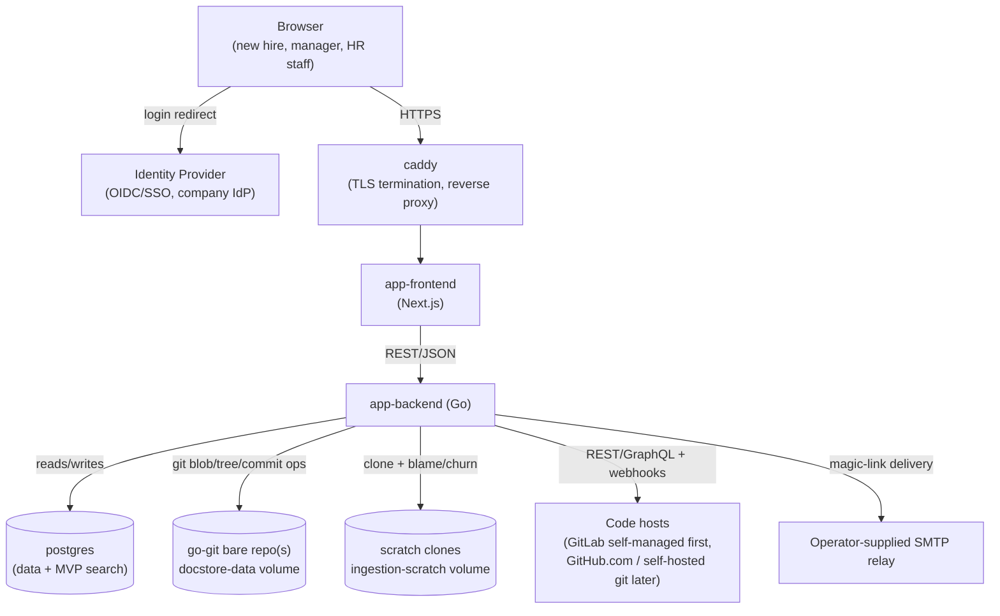
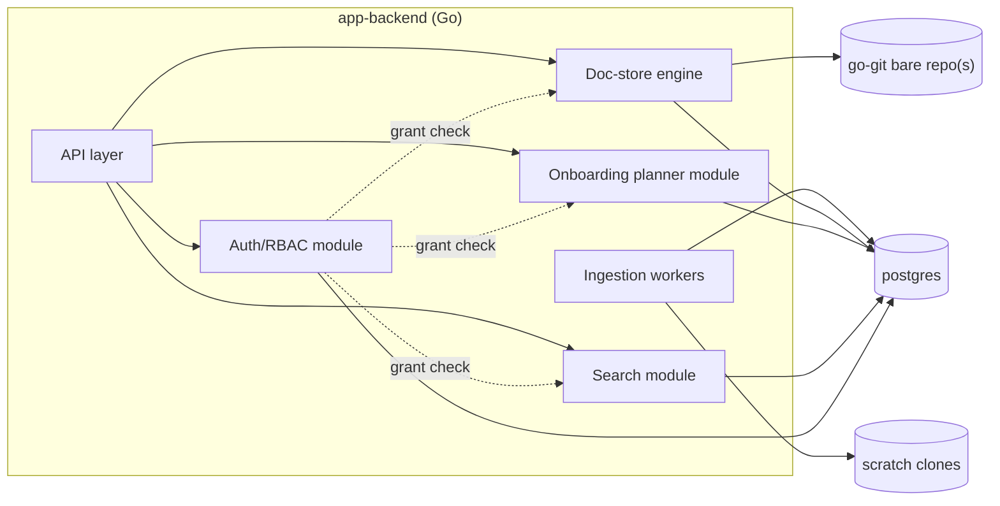
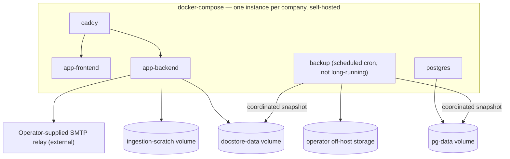
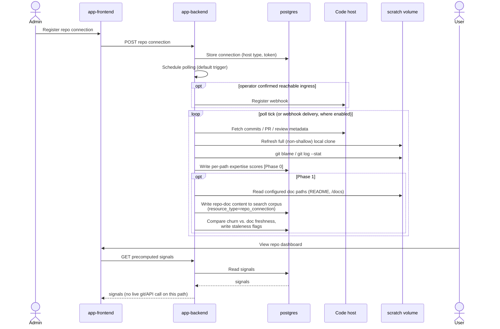
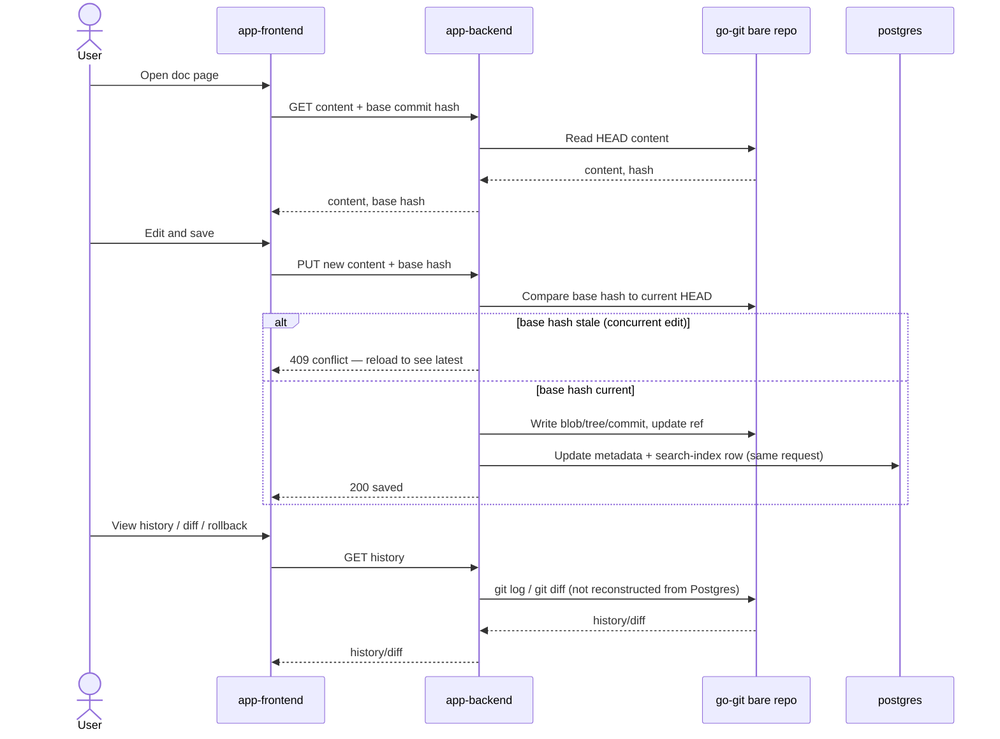
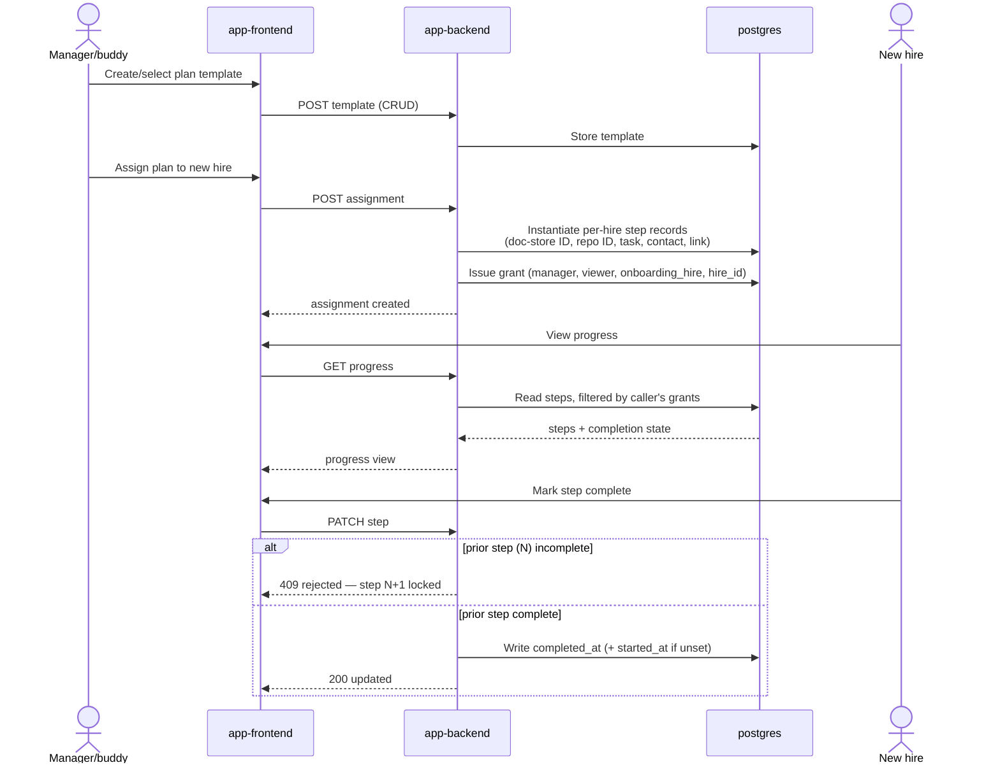
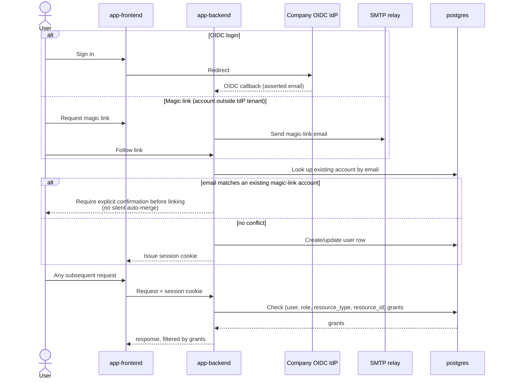

# cold_start — Architecture Diagrams

> Companion to [03-architecture.md](03-architecture.md) — every diagram here is a direct visualization of a section there; component names, module names, and flow steps match exactly so the two stay easy to cross-check. Where a diagram and the prose ever disagree, the prose in 03-architecture.md is authoritative and this file has drifted and needs fixing.

## 1. System Context

Matches architecture §1.

## 2. Backend Component Breakdown

Matches architecture §2.2 — `app-backend` is a single binary/service at MVP, internally modularized. Solid arrows are data/control flow; dashed arrows are permission checks (every write and read path routes through Auth/RBAC before touching its target).

## 3. Deployment Topology

Matches architecture §4.

## 4. Sequence: Repository Ingestion → "Who to Ask" (Phase 0) / Staleness Signals & Repo-Doc Search (Phase 1)

Matches architecture §3.1. Phase boundary marked inline — the Phase 1 steps are additive, not a rework of the Phase 0 loop.

## 5. Sequence: Non-Code Doc Edit

Matches architecture §3.2.

## 6. Sequence: Onboarding Plan Assignment

Matches architecture §3.3.

## 7. Sequence: Auth

Matches architecture §3.4.

