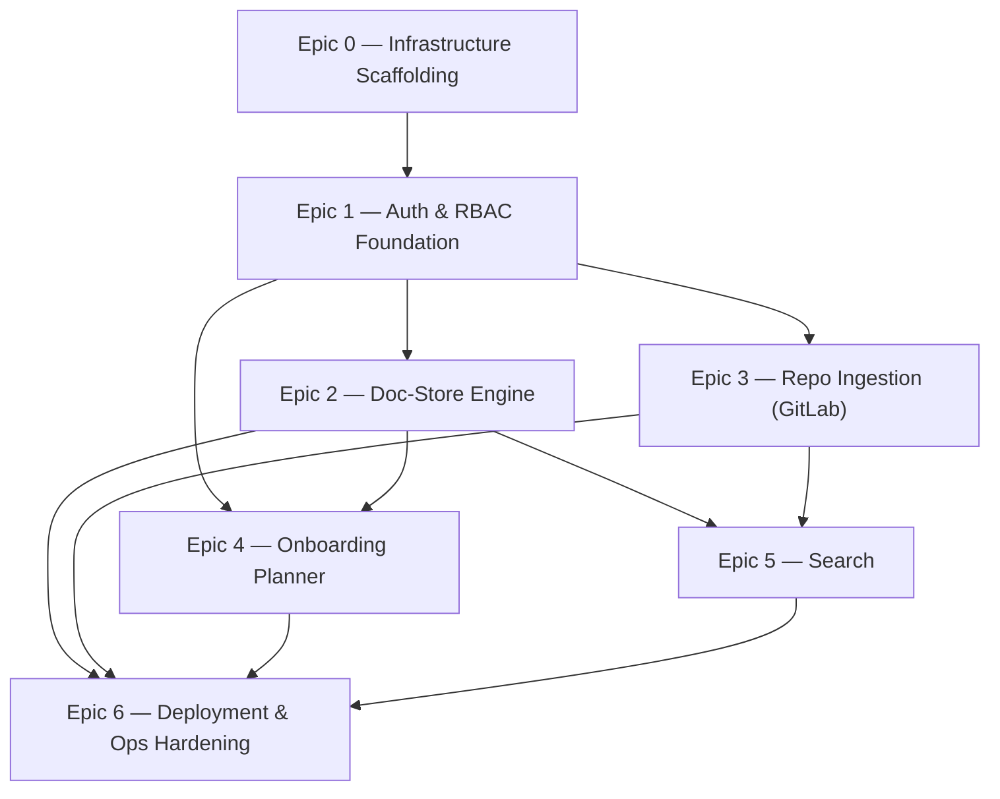

# cold_start — Development Plan (Phase 0 / MVP)

> Scoped to Phase 0 only (overview §6). Phase 1/2 features already have starting designs — see [04-open-items.md](04-open-items.md) §2 — but aren't ticketed here; do that when Phase 0 ships. Every ticket below is grounded in a specific decision already made in [02-tech-stack.md](02-tech-stack.md) or [03-architecture.md](03-architecture.md); where a ticket can't be fully specified without a decision that's still open, it says so and links [04-open-items.md](04-open-items.md) rather than guessing.

## 1. Build Order

Epics roughly bottom-up: infrastructure and auth first, since almost everything else depends on both. Doc-store, ingestion, and planner can then proceed in parallel — search and deployment hardening close out the phase since they depend on the others producing real data to index and ship.

## 2. Epic 0 — Infrastructure Scaffolding (3/4 done)

Gets a running, empty skeleton of every service talking to every other service, before any feature logic exists.

- [x] **INFRA-1**: Go module scaffolding for `app-backend` (tech-stack §2) — `chi`/thin router, config loading, health-check endpoint. *Done when:* `docker-compose up` serves a 200 from a health endpoint.
- [x] **INFRA-2**: Next.js scaffolding for `app-frontend` (tech-stack §1) — App Router, standalone build output, talks to `app-backend` over REST only (architecture §2.1). *Done when:* frontend renders a page that round-trips a call to the backend health endpoint.
- [x] **INFRA-3**: Postgres schema migration tooling (e.g. `golang-migrate` or `sqlc`-paired migrations) + base `docker-compose.yml` wiring `caddy`, `app-frontend`, `app-backend`, `postgres` (architecture §4). *Done when:* a fresh clone runs one command to a working empty stack.
- [ ] **INFRA-4**: CI: lint + build + test for both Go and Next.js on every push. Not designed elsewhere in the planning docs — baseline engineering hygiene, not a product decision.

## 3. Epic 1 — Auth & RBAC Foundation

Blocks everything else — every other module's data access goes through the grants this epic builds (tech-stack §6, architecture §2.2/§5).

- [ ] **AUTH-1**: `users`, `sessions` tables + session cookie issuance. *Done when:* a session can be created and validated server-side.
- [ ] **AUTH-2**: `(user, role, resource_type, resource_id)` grants table, with `resource_type` enum (`global`, `doc_space`, `repo_connection`, `onboarding_hire`) and middleware that checks a grant before any protected request proceeds (tech-stack §6, architecture §5). *Done when:* a request without the right grant is rejected, one with it isn't — tested against the `global` sentinel only, since Phase 0's UI exposes global roles only.
- [ ] **AUTH-3**: OIDC client integration. **Blocked on an open decision** — which reference IdP to validate against first (Keycloak / Okta / Azure AD / Google Workspace) isn't picked yet; see [04-open-items.md](04-open-items.md) §1. Pick one before starting this ticket rather than guessing.
- [ ] **AUTH-4**: Magic-link auth: request-link endpoint, SMTP delivery via operator-supplied relay (tech-stack §6, architecture §4), single-use verify-and-consume endpoint. No standalone password path — this is the only non-OIDC login route. *Done when:* a full request→email→click→session round trip works against a local test SMTP server.
- [ ] **AUTH-5**: Anti-merge rule: an OIDC login whose asserted email matches an existing magic-link account is never auto-linked — requires an explicit confirmation step; any account-recovery-equivalent event invalidates existing sessions (tech-stack §6, mitigating the Classic-Federated-Merge attack class). *Done when:* the merge-attempt path is covered by a test that asserts no silent link occurs.
- [ ] **AUTH-6**: Baseline `viewer`/`editor`/`admin` roles, assignable via an admin-only UI, `global` scope only at Phase 0.

## 4. Epic 2 — Doc-Store Engine

The non-code documentation backend (tech-stack §4, architecture §2.4).

- [ ] **DOC-1**: `go-git`-managed bare repo initialization on the `docstore-data` volume; one repo per company instance (architecture §2.4). *Done when:* the backend can init, and blob/tree/commit against, a bare repo with no external git process.
- [ ] **DOC-2**: Doc metadata table (Postgres): title, structured-content type, `resource_id` (`doc_space`), path pointer (architecture §2.3). *Blocked by AUTH-2* for the `resource_id` grant model to attach to.
- [ ] **DOC-3**: Read path: fetch current content + base commit hash for a page. *Done when:* a page round-trips through the API exactly as stored in git.
- [ ] **DOC-4**: Write path with optimistic locking: reject a save whose base hash doesn't match current `HEAD` with a conflict response, no silent overwrite or auto-merge (architecture §2.4). *Done when:* a concurrent-edit test produces a 409, not data loss.
- [ ] **DOC-5**: History/diff/rollback endpoints via `go-git` log/diff — read directly from git, never reconstructed from Postgres (architecture §3.2 step 5).
- [ ] **DOC-6**: Structured content types as YAML front-matter under a directory convention (e.g. `/teams/<slug>.md`, `/processes/<slug>.md`) (architecture §2.4).
- [ ] **DOC-7**: Scheduled `git gc --auto` job, daily cadence, same worker pool as ingestion (architecture §2.4).
- [ ] **DOC-8**: Frontend: TipTap/ProseMirror WYSIWYG editor wired to DOC-3/DOC-4, with a "this page changed, reload" conflict UI and a history/diff view against DOC-5.
- [ ] **DOC-9**: "This document was removed" UI state for deleted-page references (needed by PLAN-3, architecture §3.3 step 2) — small, but ticketed separately since it's consumed by a different epic.

## 5. Epic 3 — Repo Ingestion (GitLab)

Read-only ingestion from a single GitLab self-managed connection (tech-stack §5, architecture §2.2/§3.1).

- [ ] **ING-1**: Repo connection registration: host type, auth token, target repo, sync state (Postgres) + admin UI.
- [ ] **ING-2**: `RepoProvider` Go interface, with the GitLab implementation as the only concrete provider at Phase 0 — built as an interface from day one so GitHub/self-hosted-git can be added in Phase 1 without reworking the pipeline (tech-stack §5).
- [ ] **ING-3**: GitLab REST v4/GraphQL client: commits, MR, review/approval metadata. Includes baseline 429/`Retry-After` backoff handling — this is normal correctness for any external API client, not a separate design task (see [04-open-items.md](04-open-items.md) §1 for why this isn't deferred to Phase 1 the way an earlier draft of this plan assumed).
- [ ] **ING-4**: Local clone management on the scratch volume: **full, non-shallow** clones only (architecture §2.2/§2.5) — shallow clones were considered and rejected because `git blame` on a shallow clone misattributes any line whose real last-touching commit falls outside the fetch boundary, breaking "who to ask" accuracy (this phase) on exactly the long-untouched files that doc-staleness detection (Phase 1, built on this same clone strategy) will care about most.
- [ ] **ING-5**: Blame/churn computation via native `git` CLI shellout (not `go-git` — deliberately, `go-git`'s blame/log performance lags the native binary) → per-path expertise scores written to Postgres. Doc-staleness flags are **not** part of this ticket — that's a Phase 1 addition layered on this same blame/churn pass once repo-doc content ingestion exists to compare it against (overview §6; see the Phase 1 plan).
- [ ] **ING-7**: Polling scheduler (in-process worker pool, default trigger) + optional webhook receiver, gated on operator-confirmed reachable ingress — not assumed available (tech-stack §5).
- [ ] **ING-8**: Frontend: repo dashboard — "who to ask" per-path view, read from precomputed Postgres data only (no live API/git calls on the request path, architecture §3.1 step 5). Staleness signals aren't shown yet; the dashboard gets a new panel for them in Phase 1 rather than shipping an empty one now.

## 6. Epic 4 — Onboarding Planner

The least architecturally risky epic — standard CRUD, but with two correctness properties that must be built in from the start rather than retrofitted (architecture §2.2/§3.3).

- [ ] **PLAN-1**: Plan template + plan-step schema and CRUD. Steps reference a doc-store page **by its DOC-2 metadata-row ID, never by path** — plan templates are long-lived and reused across hires, so a step must keep resolving after the referenced page is renamed or reorganized.
- [ ] **PLAN-2**: Gating enforcement: reject a completion request for step N+1 while step N is incomplete, both in the UI and at the API layer (architecture §2.2). This is what makes "drop-off point" well-defined for the Phase 2 analytics feature later — get it right now, since it can't be retrofitted onto data that was never gated.
- [ ] **PLAN-3**: `started_at`/`completed_at` timestamp capture per step, from Phase 0 even though the feature that reads them (analytics) is Phase 2 — timing data can't be backfilled for hires onboarded before it existed.
- [ ] **PLAN-4**: Plan assignment flow: instantiate per-hire step records **and** issue the `(manager, viewer, onboarding_hire, hire_id)` grant in the same request (architecture §3.3 step 3). This grant *is* the enforcement of "visibility for managers/buddies" — there's no separate access-control mechanism for it, so this ticket isn't optional scaffolding, it's the feature.
- [ ] **PLAN-5**: Per-hire progress view, filtered by the viewer's grants from PLAN-4. *Blocked by AUTH-2*.
- [ ] **PLAN-6**: Frontend: template builder UI, per-hire progress/checklist UI (consumes DOC-9's "removed" state for dead doc references).

## 7. Epic 5 — Search (Doc-Store Content Only)

Postgres FTS with permission-aware results from day one (tech-stack §7, architecture §2.2/§2.3). Scoped to doc-store content for Phase 0 — it ships now because it's structurally tied to the doc-save flow (DOC-4), not because "search" as a whole feature is Phase 0. Extending the same corpus to repo-doc content is a Phase 1 ticket (see the Phase 1 plan), not part of this epic.

- [ ] **SEARCH-1**: `tsvector` indexes over doc-store content only (synced on write, DOC-4) — explicitly *not* over the derived ingestion signals (expertise scores), which are structured dashboard data, not search text. Repo-doc content joins this same index in Phase 1; no rework needed here to support that later, just a new writer.
- [ ] **SEARCH-2**: Query-time permission filtering: every query carries a `WHERE (resource_type, resource_id) IN (caller's current allowed resources)` predicate evaluated as part of the query itself, sourced from the live grants table — never a permission snapshot cached at index time. This is not an optional hardening pass; ship without it and search becomes an information-disclosure path around the RBAC model built in Epic 1.
- [ ] **SEARCH-3**: Text search configuration decision: evaluate `simple` vs. `english` vs. a custom config against real doc-store content for Phase 0. Doc-store content is prose-like (company docs, processes), so this is a smaller decision now than it will be in Phase 1 — re-evaluate once code-shaped repo-doc content (READMEs, technical docs) joins the corpus, since that content tokenizes differently and may need a different config or a per-source override.
- [ ] **SEARCH-4**: `pg_trgm` fuzzy matching for typo tolerance.
- [ ] **SEARCH-5**: Frontend: search UI.

## 8. Epic 6 — Deployment & Ops Hardening

Closes out Phase 0 with a deployment story that's actually complete, not just "docker-compose up and hope" (tech-stack §8, architecture §4).

- [ ] **OPS-1**: Full `docker-compose.yml`: `caddy`, `app-frontend`, `app-backend`, `postgres`, `backup` — matching the topology in architecture §4.
- [ ] **OPS-2**: Caddy TLS configuration for all three deployment cases, selected by operator config rather than assumed: HTTP-01/TLS-ALPN-01 (public ingress), DNS-01 (internal-only + supported DNS provider — requires bundling the matching Caddy DNS plugin), or local/internal CA (internal-only, no DNS provider — requires documenting manual root-cert trust distribution).
- [ ] **OPS-3**: Backup job: coordinated `pg_dump` + `git bundle` from the same run, shipped to operator-controlled off-host storage. Must be a single coordinated snapshot of both volumes, not two independently-scheduled backups — the doc-store edit flow (DOC-4) writes git and Postgres in the same request, so uncoordinated backups can restore to two different points in time.
- [ ] **OPS-4**: Self-hosting setup documentation: environment variables, first-run admin bootstrap, SMTP relay configuration, TLS mode selection (OPS-2).
- [ ] **OPS-5**: Data retention: implement whatever policy comes out of the legal/compliance review tracked in [04-open-items.md](04-open-items.md) §1 for commit-author data and onboarding-completion timing. **Blocked on that review**, not an engineering decision to make unilaterally — don't guess at a retention window.

## 9. What's Deliberately Not Here

Phase 1 (additional code hosts, doc-staleness detection built on Phase 0's blame/churn pass, repo-doc content extension to search) and Phase 2 (contextual surfacing, notifications, calendar, audit log, analytics, finer-grained permission population) are out of scope for this plan — see [07-phase-1-development-plan.md](07-phase-1-development-plan.md) and [08-phase-2-development-plan.md](08-phase-2-development-plan.md).
