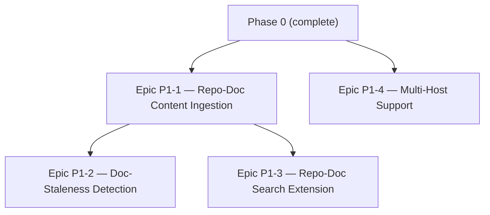

# cold_start — Development Plan (Phase 1 — Freshness & Multi-Source)

> Scope per overview §6, Phase 1: doc-staleness detection, additional code hosts, search across both doc sources. Assumes [06-development-plan.md](06-development-plan.md) (Phase 0) is complete — every ticket here builds on a Phase 0 component rather than re-describing it. Ticket IDs are prefixed `P1-` to keep them visually distinct from Phase 0's, even out of context.

## 1. Build Order

Repo-doc content ingestion is the shared foundation both staleness detection and the search extension need — it's the one piece worth building before either, not in parallel with them. Multi-host support is independent and can proceed alongside everything else once Phase 0's `RepoProvider` interface exists (it already does).

## 2. Epic P1-1 — Repo-Doc Content Ingestion

This is the ticket that was originally going to ship in Phase 0 (as `ING-6`) until review found it belonged here instead — full reasoning in [04-open-items.md](04-open-items.md). Both of this phase's other content-facing epics depend on it.

- **P1-ING-1**: From the local clone Phase 0's ingestion worker already maintains (`ING-4`), read the text content of the repo connection's configured documentation paths (`README.md`, `/docs`) and write it into the search corpus, tagged `(resource_type=repo_connection, resource_id=<repo>)` — same grant model Phase 0 already built (architecture §3.1 step 4). Scoped to designated doc paths, not the whole codebase, so this stays "search over docs," not general code search.
- **P1-ING-2**: Admin UI to configure which paths count as "documentation" per repo connection, with a sane default (`README*`, `/docs/**`) so it works out of the box without configuration for the common case.

## 3. Epic P1-2 — Doc-Staleness Detection

Layered on Phase 0's blame/churn pass (`ING-5`) once P1-ING-1 gives it something to compare against — this is why staleness detection couldn't ship in Phase 0 even though the underlying churn data already existed then.

- **P1-STALE-1**: Staleness heuristic: compare a path's code churn (already computed, `ING-5`) against the last-modified timestamp of the nearest documentation file covering it (from P1-ING-1). **The exact threshold/algorithm is a product decision, not fully specified yet** — e.g., "flag if churn in the last N days exceeds M commits with no corresponding doc touch" is a starting shape, but N and M need a real answer before this ships, probably by testing against a real repo's history rather than picking numbers in the abstract.
- **P1-STALE-2**: `staleness_flags` storage: per-path flag + the churn/doc-touch data that justified it (for showing *why* something's flagged, not just that it is — a bare flag with no explanation is much less actionable).
- **P1-STALE-3**: Frontend: staleness panel on the repo dashboard (extends `ING-8`, which deliberately shipped without this in Phase 0).
- **P1-STALE-4**: Extend the retention/anonymization policy review already tracked in [04-open-items.md](04-open-items.md) to cover staleness-flag data if it ends up correlated with specific authors' activity — check before shipping, don't assume it's covered by the existing commit-author review.

## 4. Epic P1-3 — Repo-Doc Search Extension

Extends Phase 0's doc-store-only search (`SEARCH-1`–`SEARCH-5`) to the second content source, using the same query-time permission filter already built — this is largely a corpus extension, not new search infrastructure.

- **P1-SEARCH-1**: Wire P1-ING-1's output into the same `tsvector` index `SEARCH-1` already maintains. This is the point where Phase 0's permission-filtering design (`SEARCH-2`) either proves it generalizes to a second `resource_type` or doesn't — treat the first real repo-doc search result as the actual test of that design, not just a feature demo.
- **P1-SEARCH-2**: Re-evaluate the text search configuration decision (`SEARCH-3`) now that code-shaped content (READMEs, technical docs with file paths and identifiers) joins the prose-heavy doc-store corpus — the Phase 0 config choice was only validated against doc-store content.
- **P1-SEARCH-3**: Frontend: label/distinguish result source (doc-store page vs. repo doc) in the existing search UI (`SEARCH-5`), so "search across both doc sources" (overview §6) is visibly true to the user, not just true in the index.

## 5. Epic P1-4 — Multi-Host Support

Independent of the other three epics — built entirely behind the `RepoProvider` interface Phase 0 already established specifically so this wouldn't require touching the ingestion pipeline (tech-stack §5).

- **P1-HOST-1**: GitHub.com `RepoProvider` implementation — REST + GraphQL v4 client for commits/PR/review metadata, same shape as the GitLab provider built in Phase 0 (`ING-3`).
- **P1-HOST-2**: GitHub-specific rate-limit/backoff tuning. Phase 0's `ING-3` ticket already covers baseline 429/backoff handling as general correctness — what's genuinely new here is GitHub's specific limit structure (REST's hourly quota vs. GraphQL's point-based budget are different shapes from GitLab's limits), which needs its own tuning, not a copy-paste of GitLab's numbers. This is the "multi-host budget allocation" piece [04-open-items.md](04-open-items.md) flagged as the actually-Phase-1-specific part of the rate-limit question.
- **P1-HOST-3**: Generic self-hosted git `RepoProvider`: clone-only, no host API — metadata (contributors, "who to ask") derived purely from local git history, since arbitrary self-hosted git servers don't have a review/approval API to call (tech-stack §5). PR/MR-review-derived signals simply won't exist for this provider type; that's an accepted, inherent limitation of hosts without a review API, not a bug to fix.
- **P1-HOST-4**: Frontend: repo-connection setup UI extended to offer host-type selection (GitLab / GitHub / generic self-hosted git) instead of the Phase 0 single-host assumption.
