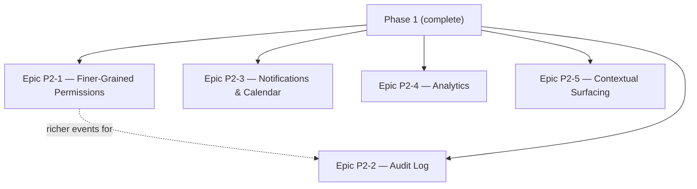

# Onboarding Hub — Development Plan (Phase 2 — Comfort & Scale)

> Scope per overview §6, Phase 2. Every epic below already has a starting design in [03-architecture.md](03-architecture.md) §6 and [04-open-items.md](04-open-items.md) §2 — this document tickets the reasoning already done there, it doesn't redo it. Assumes Phase 0 ([06-development-plan.md](06-development-plan.md)) and Phase 1 ([07-phase-1-development-plan.md](07-phase-1-development-plan.md)) are complete.

## 1. Build Order

Mostly independent epics — Phase 2 is "comfort" features layered onto a settled core, not a chain of dependencies the way Phase 0 was. The one real dependency: the audit log is more useful once finer-grained permissions exist to generate grant-change events worth logging, so sequencing it second (not first) gets more value per ticket, though neither strictly blocks the other.

## 2. Epic P2-1 — Finer-Grained Permissions

Populates the `resource_type` values Phase 0 deliberately left unused (tech-stack §6, architecture §5). One is already done: `onboarding_hire` grants have been issued since Phase 0's `PLAN-4` ticket — that's not new work here, it's the proof this model already works. What's actually new is `doc_space` and `repo_connection`.

- **P2-PERM-1**: **Define what a "doc space" actually is before building UI for it** — this wasn't fully pinned down earlier. The doc-store currently groups pages by directory convention (`/teams/<slug>.md`, `/processes/<slug>.md`, architecture §2.4), but nothing says whether a "doc space" grant boundary is *the directory*, an explicit tag/grouping independent of directory structure, or something else. Resolve this first; the rest of the epic depends on the answer.
- **P2-PERM-2**: Admin UI: assign `(user, role, resource_type=doc_space, resource_id)` grants per space (once P2-PERM-1 defines the boundary).
- **P2-PERM-3**: Admin UI: assign `(user, role, resource_type=repo_connection, resource_id)` grants per repo connection — restricts who can see a given repo's "who to ask"/staleness dashboard and search results, reusing the same query-time filter Phase 0's search module (`SEARCH-2`) already applies uniformly across resource types.
- **P2-PERM-4**: Migration path for existing Phase 0 `global`-scoped grants: decide whether finer-grained grants *replace* a user's global grant or *layer on top of it* (e.g., "global viewer, but editor on this one space") — a real product decision, not just a schema question, since the two produce different admin mental models.

## 3. Epic P2-2 — Audit Log

Postgres table, INSERT-only grants — no UPDATE/DELETE, not even for admin-scoped app roles (tech-stack practice cited in architecture §6: an alterable log doesn't provide real assurance against the actors it exists to check).

- **P2-AUDIT-1**: `audit_log` table with an INSERT-only database grant enforced at the DB layer, not just application logic — the whole point is that even a compromised or malicious admin session can't edit history through a code path that was never given permission to.
- **P2-AUDIT-2**: Hook into permission/role grant changes (Epic P2-1's writes) and repo-connection credential changes (Phase 0's `ING-1`).
- **P2-AUDIT-3**: Hook into auth events — specifically the account-linking confirmation and session-invalidation events Phase 0's `AUTH-5` already defined but never persisted anywhere (architecture §6). This closes that gap.
- **P2-AUDIT-4**: Deliberately excludes doc-store content edits — those already have full history via git (architecture §2.4, `DOC-5`). Don't build a second history mechanism for the same data.
- **P2-AUDIT-5**: Admin UI: audit log viewer with filtering by event type, actor, and date range.

## 4. Epic P2-3 — Notifications & Calendar

Two features, ticketed together since they share the recipient-resolution requirement (overview §6).

- **P2-NOTIF-1**: Email delivery via the SMTP relay already required for magic-link auth since Phase 0 (tech-stack §6) — no new infrastructure, just a new sender.
- **P2-NOTIF-2**: Slack integration: bot token or incoming webhook credential (operator-supplied), added to the deployment topology (architecture §4) — this **is** new infrastructure, unlike email.
- **P2-NOTIF-3**: Recipient resolution goes through the `onboarding_hire` grants already issued at plan-assignment time (Phase 0's `PLAN-4`), never a separately configured channel or distribution list — this is a hard requirement, not a preference: without it, a reminder about a specific new hire's progress becomes a side-channel around the RBAC model the rest of the system enforces.
- **P2-NOTIF-4**: Milestone-triggered `.ics` file generation — no OAuth, no stored calendar credentials, no live sync (deliberately scoped down, see [04-open-items.md](04-open-items.md)). Full two-way calendar sync remains explicitly out of scope, not just deferred.
- **P2-NOTIF-5**: Admin UI: configure which milestones trigger a notification and through which channel(s).

## 5. Epic P2-4 — Analytics

The data this needs (`started_at`/`completed_at` per step, gated progression) has been captured since Phase 0's `PLAN-2`/`PLAN-3` specifically so it wouldn't need backfilling now.

- **P2-ANALYTICS-1**: Aggregate query: onboarding completion time (elapsed time from plan assignment to final step completion) per hire and rolled up.
- **P2-ANALYTICS-2**: Aggregate query: drop-off points — furthest gated step reached before a plan stalls, aggregated across hires. Well-defined specifically because Phase 0 made progression gated; this ticket would have been far harder (or ill-defined) without that earlier decision.
- **P2-ANALYTICS-3**: Individual-level timing view for a hire's manager/buddy — already access-controlled via the `onboarding_hire` grant from Phase 0, no new permission work needed here, just a UI reading data that's already correctly scoped.
- **P2-ANALYTICS-4**: Aggregate/company-wide dashboard. **Blocked on the retention/anonymization review** tracked in [04-open-items.md](04-open-items.md) — onboarding-completion behavior is personal data about specific employees; don't ship a company-wide view before that review lands.

## 6. Epic P2-5 — Contextual Surfacing

The simplest epic in this phase — deliberately scoped down to admin-curated links rather than automatic relatedness detection, which was assessed as a much larger and vaguer undertaking than the feature needs to start with (architecture §6).

- **P2-CONTEXT-1**: Link table: `repo_connection` ↔ one or more doc-store metadata rows (reuses Phase 0's stable-ID pattern from `PLAN-1`, not a new referencing mechanism).
- **P2-CONTEXT-2**: Admin UI to create/manage these links.
- **P2-CONTEXT-3**: Frontend: show linked docs on the repo dashboard (extends `ING-8`) and linked repos on the relevant doc page — both directions of "and vice versa" from the original feature description (overview §5.4).
